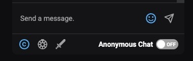
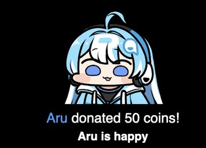
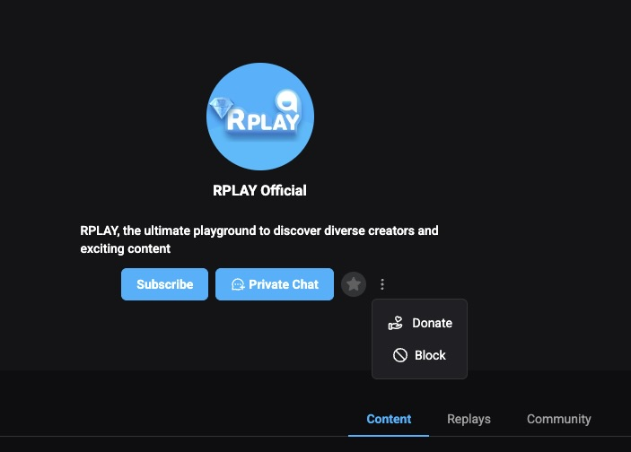

# Sponsorship

***

## Live Sponsorship

You can support creators during a live stream through chat sponsorship, roulette sponsorship, and mission sponsorship.

<figure><figcaption></figcaption></figure>


For free broadcasts, sponsorship allows you to watch in 1080p quality. (Not applicable if the creator streams in 720p.)


### Chat Sponsorship

When you send a chat sponsorship, your message will be highlighted in the chat window. Depending on the creator's settings, it may also appear on the broadcast screen with TTS (Text-to-Speech) enabled.

<figure><figcaption></figcaption></figure>

### Roulette Sponsorship

This sponsorship spins a roulette wheel set by the creator, applying preset amounts, items, and probabilities.

<figure><figcaption></figcaption></figure>

### Mission Sponsorship

Mission sponsorship allows you to propose a challenge to the creator along with a reward amount.

Creators can accept or decline missions and set a minimum sponsorship amount. If a mission is canceled midway, a cancellation fee set by the creator may apply.

<figure><figcaption></figcaption></figure>

### Lovense Sponsorship

If the creator has Lovense integration enabled, `Chat Sponsorship` can activate their connected Bluetooth adult device.

By sending a chat sponsorship with the appropriate coin amount, you can control the device’s intensity, duration, and movement pattern according to the creator’s settings.

<figure><figcaption>
Example of the settings menu displayed on the broadcast screen
</figcaption></figure>

***

## General Sponsorship

### Channel Sponsorship

You can send a sponsorship along with a support message by clicking the menu button next to the 1:1 chat button on the creator's channel.

<figure><figcaption></figcaption></figure>

### Comment Sponsorship

By clicking the sponsorship button next to the comment section, you can sponsor a specific piece of content while leaving a supportive comment.\
\*Sponsored comments are pinned to the top of the comment list.

<figure><figcaption></figcaption></figure>
