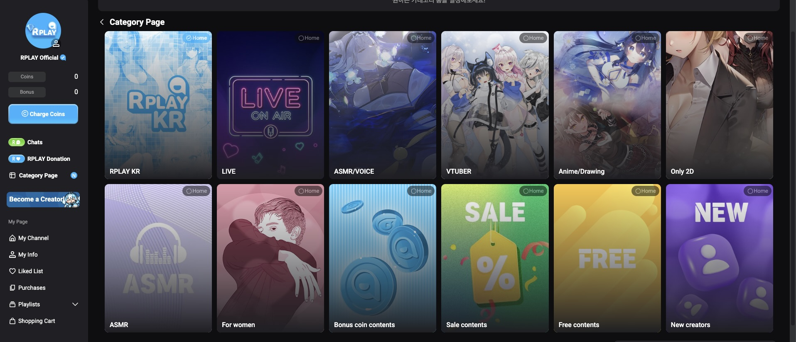

# Category Home

## What Are Category Home Settings?

> A feature that lets you set your favorite category page in RPLAY as your homepage.\
> If you only want to see creators and content you love, set that page as your homepage now!

* When you set a page as your homepage, it becomes your default landing spot on RPLAY.
  * Visiting rplay.live or tapping the RPLAY logo in the top left takes you to your custom homepage instead of the default one.
* Audio fans can set the ASMR/Voice page as their homepage, VTuber fans can pick the VTUBER page, and so on.

<figure><figcaption></figcaption></figure>

***

## How to Set It Up

1. Tap the `Category Pages` button in the sidebar to visit category pages.
2. Browse the pages, then tap the `Home` button in the top right of your favorite one to set it as your homepage.


When accessing RPLAY from overseas, use category pages to jump to the Korean version of RPLAY.

