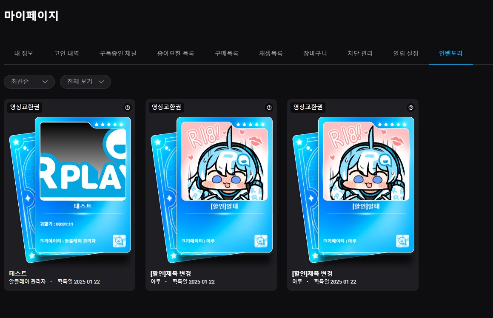
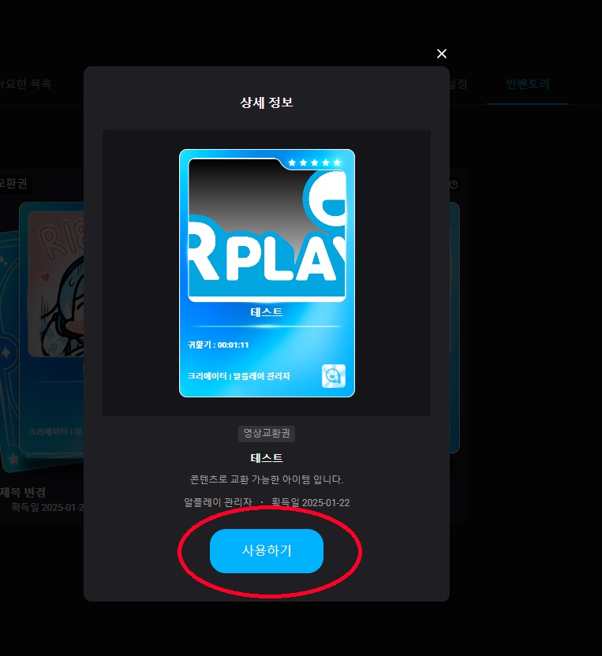

# 가챠

가챠는 확률 기반의 뽑기 시스템으로, 원하는 크리에이터의 콘텐츠를 색다른 방식으로 만나볼 수 있는 기능입니다.

가챠를 통해 다양한 상품을 랜덤으로 획득할 수 있으며, 어떤 콘텐츠가 나올지 기대하는 즐거움을 느낄 수 있습니다.  \
크리에이터가 직접 설정한 콘텐츠와 확률에 따라 특별한 보상을 받을 수도 있습니다. &#x20;

가챠를 통해 더욱 재미있고 신선한 방식으로 크리에이터의 다양한 콘텐츠를 경험해보세요! &#x20;

## 👉 1. 가챠 즐기기

### **1. 가챠 구입하기**

<figure><figcaption></figcaption></figure>

* 가챠 1회 또는 10회 버튼으로 원하는 횟수만큼 가챠를 즐기실 수 있습니다.
* 기존에 보유중인 코인으로 결제하실 수 있고, 잔여코인이 없다면 구매페이지로 자동 전환됩니다.

***

### **2. 가챠  개봉하기**

<figure><figcaption></figcaption></figure>

* 카드를 구입한 후 카드를 직접 드래그하여 뜯거나 빠른개봉을 눌러 바로 확인해보실 수 있습니다.

***

<figure><figcaption></figcaption></figure>

* 당첨된 콘텐츠를 확인한 후 인벤토리 보기를 눌러 내가 얻은 아이템을 확인할 수 있습니다.
* 더 뽑기를 원하시면 다음을 눌러 다시 가챠를 뽑으실 수 있습니다.

***

### **3. 가챠 교환하기**

<figure><figcaption></figcaption></figure>

* 내 정보의 인벤토리로 가서 내가 얻은 가챠 아이템을 확인할 수 있습니다.

***

<figure><figcaption></figcaption></figure>

* 교환권을 눌러 <mark style="color:red;">**사용하기**</mark> <mark style="color:red;"></mark> 를 눌러 영상으로 교환할 수 있습니다.

***

### **4. 구매한 콘텐츠 확인하기**

* 구매목록으로 들어가서 내가 교환한 콘텐츠를 확인하실 수 있습니다.
