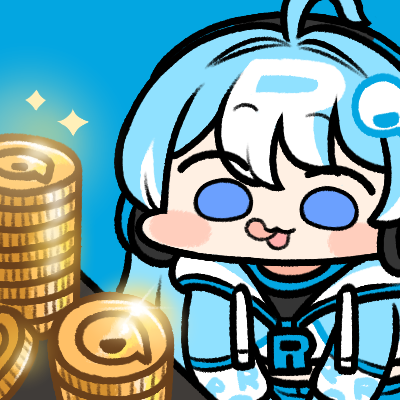

# 코인 안내

***

## 알플레이 코인

* 알플레이 코인은 **알플레이 내에서 사용되는 화폐**입니다.
* 유료 콘텐츠 구매, 라이브 티켓 구매, 후원(채팅, 룰렛, 미션 등), 메시지 발송, 앱 내 코인 구독 등에 자유롭게 사용할 수 있습니다.
* 코인으로 구매한 콘텐츠, 다시보기는 구매목록 내에 보관되며, 탈퇴 전까지 계속 이용하실 수 있습니다.
* 코인은 알플레이 웹, 앱에서 모두 구매 가능하며, 앱에서 구매 시 스토어 수수료가 추가로 반영합니다.
* 코인 구매 시 10%의 부가세가 부과되며, 구매한 코인의 유효기간은 구매일로부터 5년입니다.
* 획득 및 사용한 코인은 [`내 정보 - 코인 내역`](https://rplay.live/myinfo/?toWhere=coin-usage)에서 확인하실 수 있습니다.

### 코인 충전 한도 안내

* 알플레이 코인 충전은 결제사 정책에 따라 결제 수단 별 한도가 적용되어 있습니다. (결제수단 별/일 별/건 별)
* 결제 수단 별 한도
  *   신용카드(다날)/카카오페이

      <figure><figcaption></figcaption></figure>
  * 신용카드(페이레터)로 결제 시 한도 제한 없음
    * `신용카드결제(카드번호)`를 선택 시 결제대행사 페이레터를 통해 결제됩니다.\
      .png>)
  * 원터치 결제 옵션 활성화 시, 최초 1회만 카드정보 입력이 필요하며 이후 간편 결제가 가능합니다.
  * 원터치 결제 옵션 비활성화 하셔도 단 건 결제 가능합니다.

## 보너스 코인

* 보너스 코인은 코인 충전 시 보너스로 증정되거나, 이벤트를 통해 지급되는 무료로 지급되는 코인입니다. 보너스 코인의 기능과 가치는 알플레이 코인과 동일합니다.
* 보너스 코인 사용가능 여부는 크리에이터 님의 설정에 따라 다르며, 가용한 경우 보너스 코인이 먼저 차감되게 됩니다.
* 보너스 코인 사용 가능 콘텐츠가 궁금하다면 검색 창에 ‘<mark style="color:blue;">`보너스코인`</mark>’을 검색해주세요.
* 구독, 후원 등 일부 상품에는 보너스 코인 사용이 불가합니다.

***

## 무료 코인 이벤트


알플레이에서 진행하는 다양한 이벤트를 통해 알플레이 코인 또는 보너스 코인을 받을 수 있습니다.\
지금 바로 참여 가능한 이벤트를 확인해보세요!

이벤트 페이지 바로가기 : [https://rplay.live/p/kr-event](https://rplay.live/p/kr-event)


<figure><figcaption></figcaption></figure>

***
